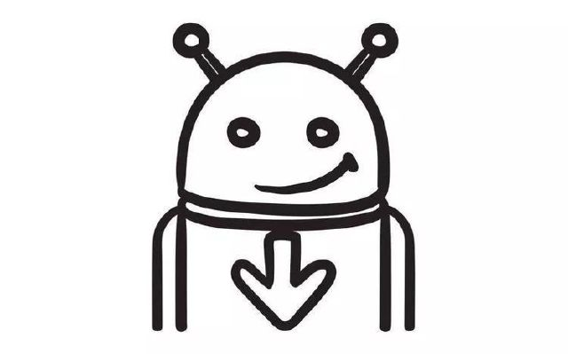
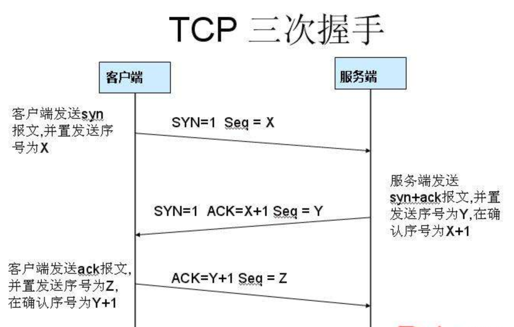

** 知识体系主要从设计模式、网络、Linux、Java、Android这几个方面整理[#参考](https://time.geekbang.org/column/article/86498).**

## 设计模式 
- **_六大设计原则_**
       * 单一职责
       * 里氏替换
       * 依赖倒置
       * 接口隔离
       * 迪米特法则
       * 开闭
- **_设计模式_**
       * 单例
       * 工厂
       * 迭代器
       * 观察者
       * 适配器
       * 访问者
       * 代理模式
       * 外观模式
       * 组合模式
       * 装饰模式
      

## 网络

**http三次握手**

--------------------- 
第一次：发送SNY=1表示此次握手是请求建立连接的，然后seq生成一个客户端的随机数X

第二次：发送SNY=1,ACK=1表示是回复请求建立连接的，然后ack=客户端的seq+1（这样客户端收到后就能确认是之前想要连接的那个服务端），然后把服务端也生成一个代表自己的随机数seq=Y发给客户端。

第三次：ACK=1。 seq=客户端随机数+1，ack=服务端随机数+1（这样服务端就知道是刚刚那个客户端了）

**为什么建立连接需要三次握手？**

首先非常明确的是两次握手是最基本的， 
第一次握手，C端发了个连接请求消息到S端，S端收到后S端就知道自己与C端是可以连接成功的，但是C端此时并不知道S端是否接收到这个消息，所以S端接收到消息后得应答，C端得到S端的回复后，才能确定自己与S端是可以连接上的，这就是第二次握手。C端只有确定了自己能与S端连接上才能开始发数据。所以两次握手肯定是最基本的。

**那么为什么需要第三次握手呢？** 

假设一下如果没有第三次握手，而是两次握手后我们就认为连接建立，那么会发生什么？

第三次握手是为了防止已经失效的连接请求报文段突然又传到服务端，因而产生错误

具体情况就是：C端发出去的第一个网络连接请求由于某些原因在网络节点中滞留了，导致延迟，直到连接释放的某个时间点才到达S端，这是一个早已失效的报文，但是此时S端仍然认为这是C端的建立连接请求第一次握手，于是S端回应了C端，第二次握手。如果只有两次握手，那么到这里，连接就建立了，但是此时C端并没有任何数据要发送，而S端就会傻傻的等待着，造成很大的资源浪费。所以需要第三次握手，只有C端再次回应一下，就可以避免这种情况。

**TCP和UDP区别**

- TCP 是面向连接的，UDP 是面向无连接的
- UDP程序结构较简单
- TCP 是面向字节流的，UDP 是基于数据报的
- TCP 保证数据正确性，UDP 可能丢包
- TCP 保证数据顺序，UDP 不保证

**http和https区别**

    　　1、https协议需要到ca申请证书，一般免费证书较少，因而需要一定费用。
    
    　　2、http是超文本传输协议，信息是明文传输，https则是具有安全性的ssl加密传输协议。
    
    　　3、http和https使用的是完全不同的连接方式，用的端口也不一样，前者是80，后者是443。
    
    　　4、http的连接很简单，是无状态的；HTTPS协议是由SSL+HTTP协议构建的可进行加密传输、身份认证的网络协议，比http协议安全。

**Okhttp相关**

OkHttp是一个精巧的网络请求库,优点如下: 

    - 支持http2，对一台机器的所有请求共享同一个socket
    
    - 内置连接池，支持连接复用，减少延迟
    
    - 支持透明的gzip压缩响应体
    
    - 通过缓存避免重复的请求
    
    - 请求失败时自动重试主机的其他ip，自动重定向
    
    - 好用的API

实现网络请求方法:

OkHttp3的最底层是Socket，而不是URLConnection，它通过Platform的Class.forName()反射获得当前Runtime使用的socket库

    - socket发起网络请求的流程一般是：
        创建socket对象;
        连接到目标网络;
        进行输入输出流操作。

运用到的设计模式：

- 单例模式：（建议用单例模式创建okHttpClient）OkHttpClient， 可以通过 new OkHttpClient() 或 new OkHttpClient.Builder() 来创建对象， 但是---特别注意， OkHttpClient() 对象最好是共享的， 建议使用单例模式创建。 因为每个 OkHttpClient 对象都管理自己独有的线程池和连接池。 这一点很多同学，甚至在我经历的团队中就有人踩过坑， 每一个请求都创建一个 OkHttpClient 导致内存爆掉

- 外观模式 : OKHttpClient 里面组合了很多的类对象。其实是将OKHttp的很多功能模块，全部包装进这个类中，让这个类单独提供对外的API，这种设计叫做外观模式（外观模式：隐藏系统的复杂性，并向客户端提供了一个客户端可以访问系统的接口）

- Builder模式 : OkHttpClient 比较复杂， 太多属性， 而且客户的组合需求多样化， 所以OKhttp使用建造者模式（Build模式：使用多个简单的对象一步一步构建成一个复杂的对象，一个 Builder 类会一步一步构造最终的对象）

- 工厂方法模式：Call接口提供了内部接口Factory(用于将对象的创建延迟到该工厂类的子类中进行，从而实现动态的
配置，工厂方法模式。（工厂方法模式：这种类型的设计模式属于创建型模式，它提供了一种创建对象的最佳方式。在工厂模式中，我们在创建对象时不会对客户端暴露创建逻辑，并且是通过使用一个共同的接口来指向新创建的对象。）

- 享元模式：在Dispatcher的线程池中，所用到了享元模式，一个不限容量的线程池 ， 线程空闲时存活时间为 60 秒。线程池实现了对象复用，降低线程创建开销，从设计模式上来讲，使用了享元模式。（享元模式：尝试重用现有的同类对象，如果未找到匹配的对象，则创建新对象，主要用于减少创建对象的数量，以减少内存占用和提高性能）

- 责任链模式：很明显，在okhttp中的拦截器模块，执行过程用到。OkHttp3 的拦截器链中， 内置了5个默认的拦截器，分别用于重试、请求对象转换、缓存、链接、网络读写（责任链模式：为请求创建了一个接收者对象的链。这种模式给予请求的类型，对请求的发送者和接收者进行解耦。这种类型的设计模式属于行为型模式。在这种模式中，通常每个接收者都包含对另一个接收者的引用。如果一个对象不能处理该请求，那么它会把相同的请求传给下一个接收者，依此类推。）

- 策略模式 ：CacheInterceptor 实现了数据的选择策略， 来自网络还是来自本地？ 这个场景也是比较契合策略模式场景， CacheInterceptor 需要一个策略提供者提供它一个策略（锦囊）， CacheInterceptor 根据这个策略去选择走网络数据还是本地缓存。
缓存的策略过程：
    1、 请求头包含 "If-Modified-Since" 或 "If-None-Match" 暂时不走缓存 
    
    2、 客户端通过 cacheControl 指定了无缓存，不走缓存
    
    3、客户端通过 cacheControl 指定了缓存，则看缓存过期时间，符合要求走缓存。
    
    4、 如果走了网络请求，响应状态码为 304（只有客户端请求头包含 "If-Modified-Since" 或 "If-None-Match" ，服务器数据没变化的话会返回304状态码，不会返回响应内容）， 表示客户端继续用缓存。
        （策略模式：一个类的行为或其算法可以在运行时更改。这种类型的设计模式属于行为型模式。策略模式中，我们创建表示各种策略的对象和一个行为随着策略对象改变而改变的 context 对象。策略对象改变 context 对象的执行算法。）

## Java
       
  1. 属性
    - 反射
    - 异常
  2. 虚拟机
  3. 常用类
    - 集合
        - List
        - Set
        - HashMap
        - ThreeMap
        - LinkedHashMap
        - ConcurrentHashMap
        - Iterator
        - FastFail机制
        - Collections类
    - 并发
    - IO
        - 阻塞IO
        - NIO

## Android
       
  1. 四大组件
    - Activity
        - 生命周期
        - 启动模式
    - Service
    - Broadcast
    - Contprovider
  2. Handle机制
  3. Binder机制
  4. 渲染机制
  5. Sharepreference
  6. View/ViewGroup
  7. Touch事件
  8. 重要的Service
    - AMS
    - PMS
    - WMS
       
    