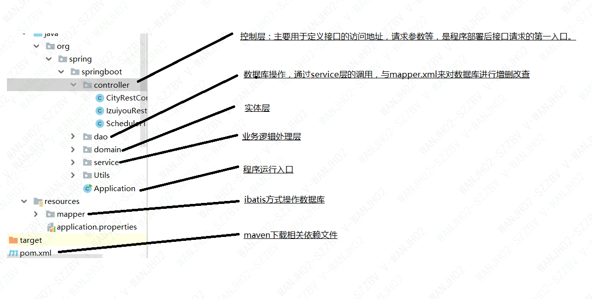
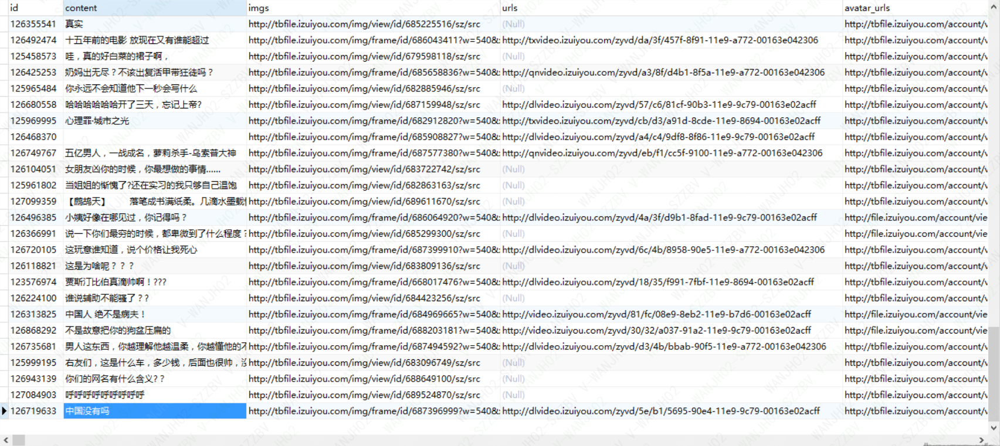

# ✋[springboot-mybatis-redis](https://gitee.com/jianhuawan/XiaoShouJia.git)

#### 介绍
此项目不具备商业用途,仅供个人使用，项目中主要是访问最右app接口，获取数据并
存储到数据库，当多次请求并且每次请求的结果不变的情况下使用redis来缓存数据
有效提高请求效率，项目中用了定时任务，每隔5s进行一次接口请求。

#### 软件架构
- springboot-mybatis-redis架构

##返回的结果截图

